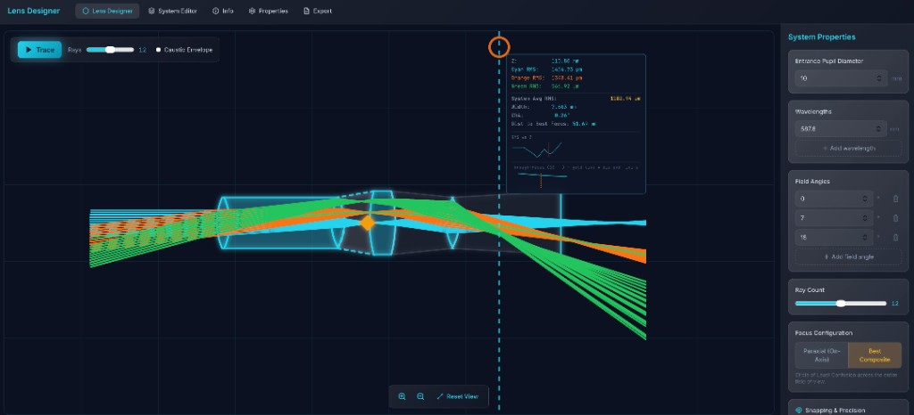

# MacOptics — Optical Ray Tracing

Open-source, license-free optical design software with a **React + FastAPI** architecture. Design singlet lenses, run ray traces, and visualize performance metrics.



---

## Tech Stack


**Platform Support** — Dynamic Alt / ⌥ Option key labels for Override Snap-to-Focus; adapts to Windows and macOS.

---

## Features

### Core Optical Engine

- **High-precision ray tracing** — Sequential ray optics via rayoptics; spot diagrams, RMS radius, and focus metrics at the image plane
- **Real-time SVG rendering** — Interactive cross-section viewport with zoom, pan, and through-focus scan line
- **Dynamic optical_stack management** — Add, edit, reorder, and remove surfaces; live state sync with backend trace

### Laser & Ultrafast Toolkit (Premium)

- **Gaussian Beam Propagation (ABCD Matrix)** — Beam waist (w₀), Rayleigh range (z_R), and envelope visualization
- **M² Beam Quality Analysis** — Configurable M² factor in System Properties for real-world laser simulation
- **Femtosecond Dispersion (GDD/TOD)** — Group Delay Dispersion and pulse metrics in the Ultrafast HUD; thermal lensing heat map for high-power CW

### Engineering & Manufacturing

- **Monte Carlo Reliability Analysis** — Tolerance jitter (R±, T±, Tilt±); point cloud yield map with in-spec vs. outlier color coding; sensitivity heatmap in System Editor
- **ISO 10110 Technical Blueprint Export** — Cross-section, dimension lines (CT), data table (Surf, S/D, Material), and title block; SVG and PDF export

### Modern UX

- **Magnetic Snapping to Focus/Surface** — Scan line snaps to best focus and surface boundaries for precise inspection
- **Space + Drag Navigation** — Pan viewport without accidental selections; double-click to reset view
- **Mac-aware Keybinding System** — ⌥ Option / Alt labels adapt to platform for Override Snap-to-Focus

---

## Architecture

```
MacOpticsApp/
├── backend/                 # FastAPI Python backend
│   ├── main.py              # API routes, CORS, request models
│   ├── trace_service.py     # Ray-tracing logic (rayoptics)
│   └── singlet_rayoptics.py # Optical model building
├── web-app/                 # React + Vite frontend
│   └── src/
│       ├── components/      # UI components
│       ├── api/             # Trace API client
│       ├── types/           # TypeScript types
│       ├── lib/             # Materials, config
│       └── config.ts        # App settings
├── tests/                   # Pytest integration tests
├── requirements.txt         # Python dependencies
└── README_API.md            # API reference
```

### Frontend (React + Vite)

- **Lens Designer** — Canvas with optical viewport; add/edit/reorder surfaces, run trace
- **System Editor** — Table of surfaces (radius, thickness, material, diameter)
- **System Properties** — Entrance pupil, wavelengths, field angles, ray count
- **State** — Single source of truth in `App.tsx`; surfaces identified by unique `id`

### Backend (FastAPI)

- **POST /api/trace** — Accepts `optical_stack` JSON, runs rayoptics, returns rays and surface curves as `(z, y)` coordinates
- **GET /api/health** — Health check
- Uses `rayoptics` for sequential ray tracing and spot diagrams

### Data Flow

1. User edits surfaces in React → state updates
2. User clicks **Trace** → frontend sends `optical_stack` to `/api/trace`
3. Backend builds optical model, traces rays, returns `{ rays, surfaces, focusZ, performance }`
4. Frontend renders rays and lens profiles in SVG viewport

## Installation

**Backend (FastAPI / Python)**

```bash
python3 -m venv venv
source venv/bin/activate   # Windows: venv\Scripts\activate
pip install -r requirements.txt
```

**Frontend (Vite / React)**

```bash
cd web-app
npm install
```

---

### Quick Start

Run both services in two terminal windows:

```bash
# Terminal 1 — Backend
uvicorn backend.main:app --reload --host 0.0.0.0 --port 8000
```

```bash
# Terminal 2 — Frontend
cd web-app && npm run dev
```

Then open **http://localhost:5173**

## Configuration

- **API URL** — Set `VITE_API_URL` (default: `http://localhost:8000`) or edit `web-app/src/config.ts`
- **Viewport / ray defaults** — See `web-app/src/config.ts`

## Tests

```bash
pytest tests/ -v
```

## API Details

See [README_API.md](README_API.md) for endpoint specs and response format.
